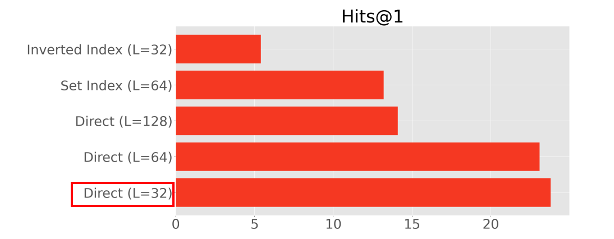
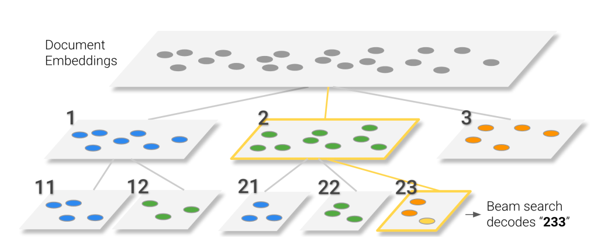
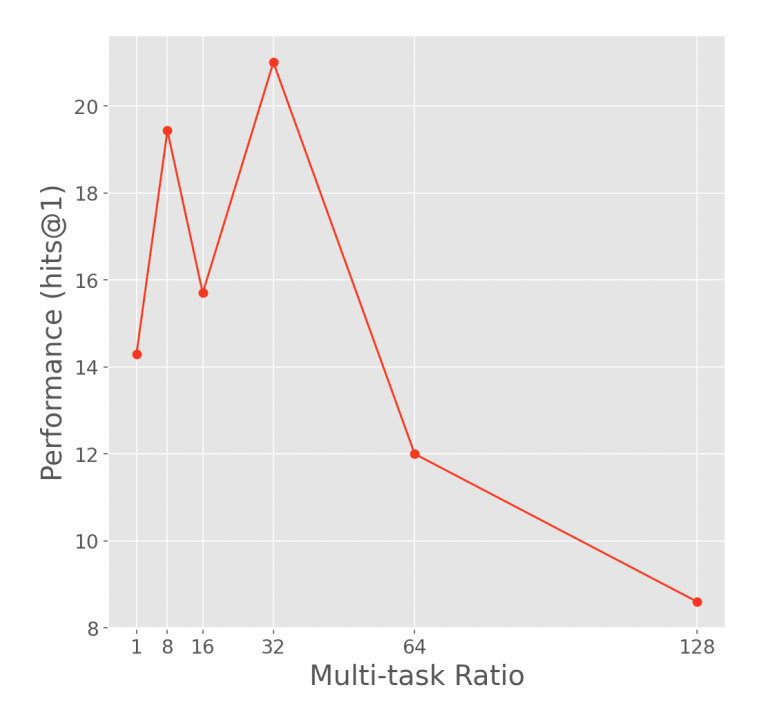
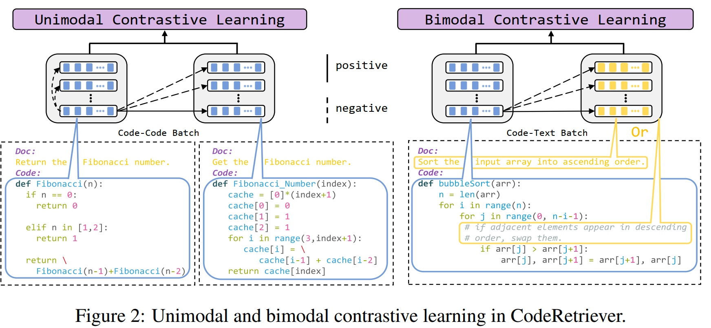
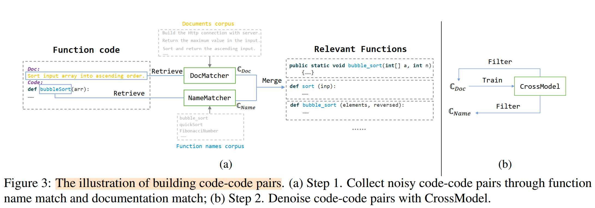

## ir-gengerate

**[Transformer Memory as a Differentiable Search Index](https://arxiv.org/abs/2202.06991). *Tay et al.*, Arxiv 2022. [[Video](https://www.youtube.com/watch?v=qlB0TPBQ7YY)] (DSI) google**

能否取代retrieval？生成的文档数量有要求吗？能太多吗

最多到320k文档，32w？

Indexing（input: document tokens, output: identifiers）+Retrieval（input: query, output:  a ranked list of candidate docids）

**a DSI model** 

- d->did: trained to index a corpus of documents
- q->did (train) : optionally fine-tune on an available set of labeled data (queries and labeled documents)
- q->did: used to retrieve relevant documents—all within a single, unified model.

options

1. what d？被编码的内容

   - 🌟 <u>Direct Indexing</u>：first L tokens of a document

   - <u>Set Indexing</u>: de-duplicates repeated terms + removes stopwords + first L tokens of a document

   - <u>Inverted Index</u>: randomly subsample a single contiguous chunk of k tokens

     

2. what did?

   - <u>Unstructured Atomic Identifiers</u>：assign each an arbitrary (and possibly random) unique integer identifier，生成一次就可以生成出来。在一个词表上执行softmax。（不适配新文档加入？）

   - <u>Naively Structured String Identifiers</u> + beam search： treats unstructured identifiers as tokenizable strings

   - 🌟<u>Semantically Structured Identifiers</u>+ beam search：需要满足（1）the docid should capture some information about the semantics of its associated document；（2） the docid should be structured in a way that the search space is effectively reduced after each decoding step；

     - a fully unsupervised pre-processing（对bert编码的doc embedding 层次聚类） -> a fully end-to-end manner(further)

       

3. how to index？

   - 🌟Inputs2Target：doc_tokens -> docid.
   - Targets2Inputs：docid -> doc_tokens
   - Bidirectional： trains both Inputs2Targets and Targets2Inputs within the same co-training setup（with prefix token ）
   - Span Corruption

4. how to train

   - two-stage ( indexing + fine-tuning: map queries to docids)
   - 🌟 co-train (multi-task learning)： (e.g., using task prompts to differentiate them).

------

**[CorpusBrain: Pre-train a Generative Retrieval Model for Knowledge-Intensive Language Tasks](https://arxiv.org/abs/2208.07652). *Chen et al.*, CIKM 2022. [[Code](https://github.com/ict-bigdatalab/CorpusBrain)]** 

好处：

- the knowledge of all documents in the corpus is encoded into the model parameters, which can be optimized directly in an end-to-end manner.
- the memory and computational cost is greatly reduced because the document index is eliminated. 

**the pre-training data**： positive pairs of query and document identifier.

 pre-train CorpusBrain on English Wikipedia

fine-tune CorpusBrain on the comprehensive KILT benchmark, 11 个数据集涵盖5个不同的 Knowledge-intensive language tasks (KILT)  任务。

（all tasks in KILT are formulated into a common interface and grounded in the same dsnapshot of Wikipedia）

**预训练任务**：输入伪查询，生成doc id。encoder-decoder architecture：Query Encoder + Identifier Decoder

Each document $p_i=\{t_i, s_i, a_i\}$ consists of a unique document identifier $t_i$ , a sequence of sentences $s_i=\{s_i^0, s_i^1, .., s_i^n\}$ （一共n个句子） , and an anchor set $a_i=\{a_i^0, a_i^1, ..., a_i^m\}$ .

**three pretraining tasks** --> build large-scale pseudo pairs of query and document identifiers without additional human supervision.  通过三种预训练任务，获得一个强大的生成模型，希望可以无缝适配下游KILT任务，无须额外的index

-  Inner Sentence Selection (ISS)：sample sentences from documents and adopt them as pseudo queries。
  - 给定文档，$p_i$  ， 伪查询 -  从 $p_i$ 随机选的 inner sentence $s_i^j$ 
  - 生成目标：把 $p_i$ 的 doc id 和 $p_i$ 中随机选择的 $o$ 个超链接的目标文档的 doc id 拼接作为生成目标, $[t_i, t_{a_i}^{s_1}, t_{a_i}^{s_2}, .., , t_{a_i}^{s_o}]$
- Lead Paragraph Selection (LPS)：sample  paragraphs from documents and adopt them as pseudo queries
  - 给定文档，$p_i$  ， 伪查询 -  从 $p_i$ 随机选的 a paragraph (regard the leading 𝑙 paragraphs as the pseudo queries)
  - 生成目标：把 $p_i$ 的 doc id 和 $p_i$ 中随机选择的 $o$ 个超链接的目标文档的 doc id 拼接作为生成目标, $[t_i, t_{a_i}^{s_1}, t_{a_i}^{s_2}, .., , t_{a_i}^{s_o}]$
- Hyperlink Identifier Prediction (HIP)：utilize hyperlinks and anchor texts to approximate the relationship between two documents
  - 给定文档 $p_i$  ，随机选择其中的一个锚点 $a_i^k$，定位到它所在的句子 $s_q$ ，用 $[s_{q-1}, s_q, s_{q+1}]$ 作为伪查询。
  - 生成目标： $a_i^k$ 对应的目标文档的 doc id $t_{a_i}^k$ 

CorpusBrain can achieve significant improvements over strong baseline solutions for the retrieval task

CorpusBrain works well even when they were fine-tuned with very little supervision

## code-ir

**2022.emnlp-Microsoft-[CodeRetriever: Large-scale Contrastive Pre-training for Code Search](https://arxiv.org/abs/2201.10866)** 

/Users/sunxiaojie/3-paper/IR/retrieval/pre-train/2022.emnlp-main.CodeRetriever.pdf

- 任务：输入query，检索对应函数。

- 动机：mlm这种token-based的预训练目标会导致poor semantic representations（1）高频tokens的embedding会聚集。控制表示空间。在编程语言中，token的imbalance比自然语言更严重。（2）code语言很多，他们几乎不会同时出现在一个context下，所以对于预训练模型来说，为不同的编程语言学习一个一致的语义表示很难。

- 贡献：针对code corpus进行预训练。构造code-code-pair、code-text-pair去进行对比学习，来学习text encoder和code encoder。

It takes <u>code-doc and code-comment paired data</u> for bimodal contrastive learning, and <u>code-code paired data</u> for unimodal contrastive learning. 

- 如何构造code-code pair（认为两个函数是相似的）？
  1. 训练两个相似度matcher，输入一个函数，分别从doc和function-name去召回相关分数高于0.75的函数
  2. 根据docmatcher获取的code-code-pair，噪声比较少，利用它去训一个噪声过滤器；把第一步得到的code-code-pair进行噪声过滤。

------

